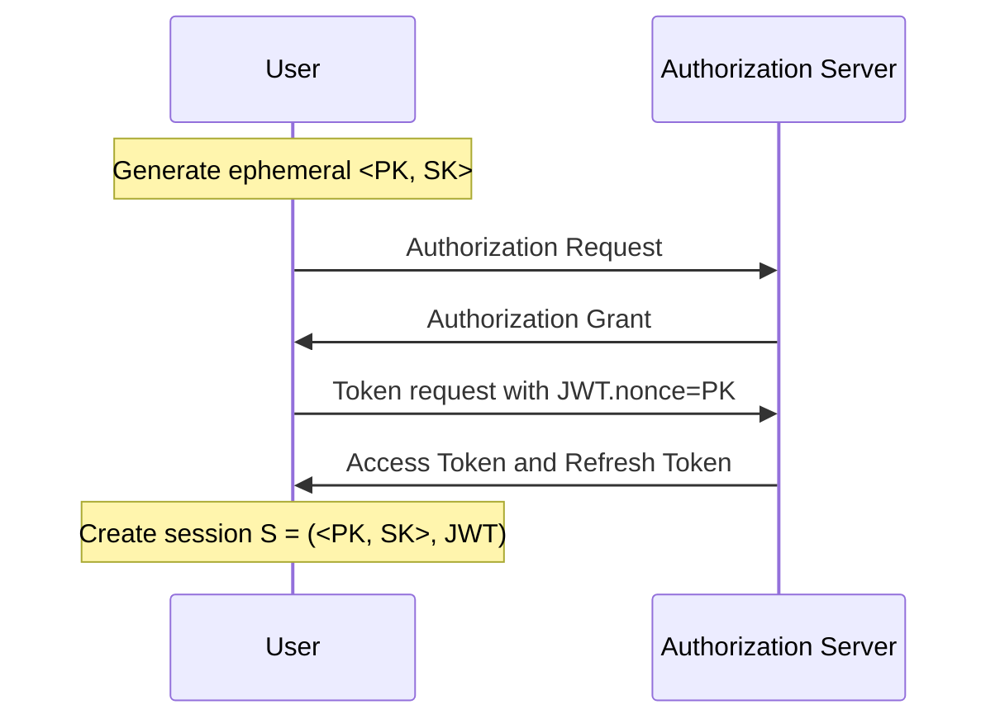
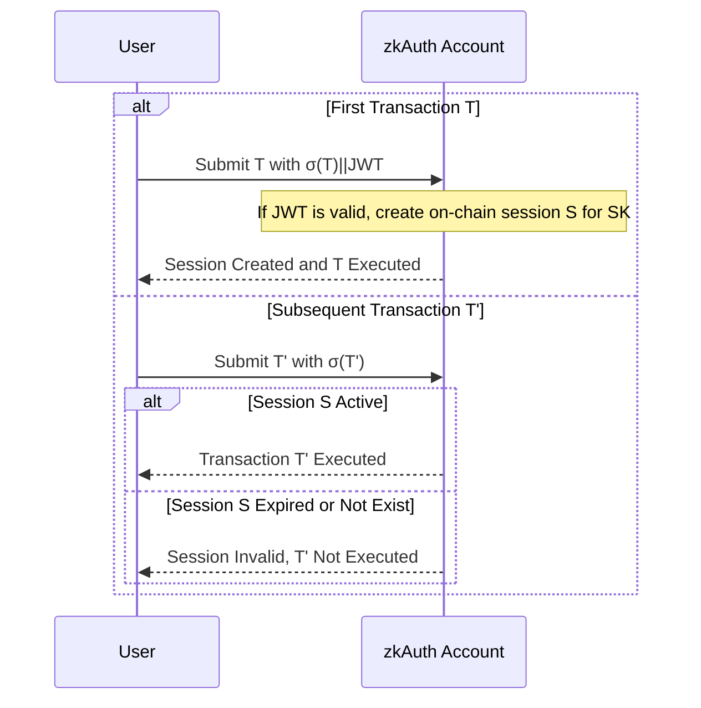
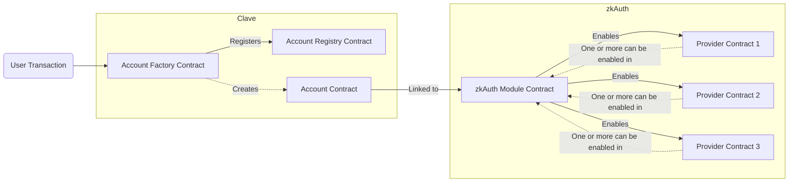
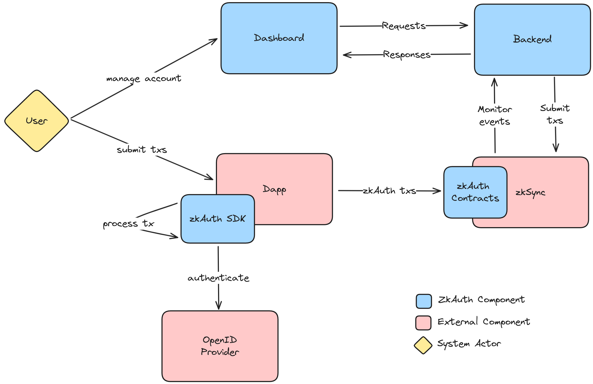
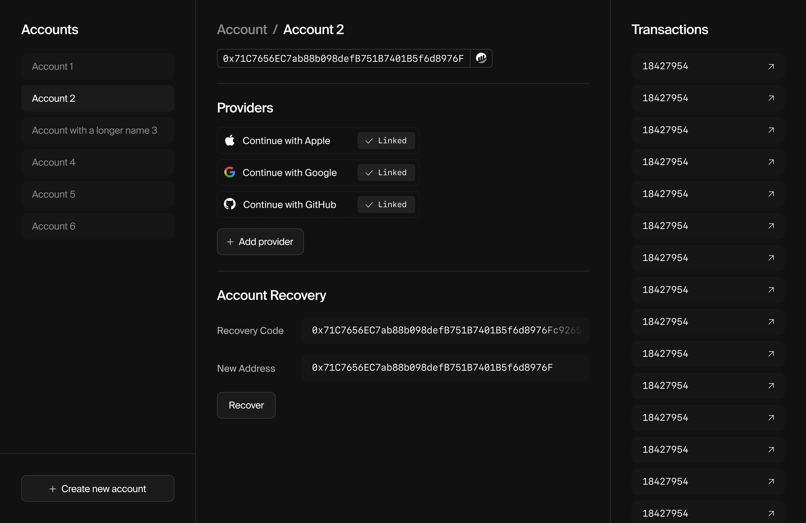

# zkAuth Litepaper

**Prepared by:** [Three Sigma](https://threesigma.xyz/)
**Date:** 29/11/2023


- [zkAuth Litepaper](#zkauth-litepaper)
  - [Introduction](#introduction)
  - [Background](#background)
    - [Account Abstraction (AA)](#account-abstraction-aa)
    - [OpenId Connect (OIDC)](#openid-connect-oidc)
  - [ZkAuth Protocol](#zkauth-protocol)
    - [Session Creation](#session-creation)
    - [Session Usage](#session-usage)
    - [Session Disposal](#session-disposal)
  - [Smart Contract System](#smart-contract-system)
    - [Account](#account)
    - [ZkAuth Module](#zkauth-module)
      - [ZkAuth Provider](#zkauth-provider)
  - [Peripherals System](#peripherals-system)
    - [SDK](#sdk)
    - [Dashboard](#dashboard)
  - [About Us](#about-us)

## Introduction
In the evolving landscape of Ethereum and the broader Web3 space, user experience has remained an unsolved challenge, particularly regarding wallet management. Traditional reliance on Externally Owned Accounts (EOAs), controlled by private keys, presents significant hurdles for widespread adoption. These challenges encompass not just technical complexity, but also heightened security risks, such as susceptibility to hacks and phishing. The Ethereum community's response has been a concerted push towards smarter, more user-friendly account models.

This pursuit led to the development and adoption of the ERC4337 standard, introducing the concept of account abstraction (AA) to Ethereum. While ERC4337 marked a significant stride forward, it came with its own set of limitations, including separate transaction flows for EOAs and Contract Accounts (CAs), a distinct mempool, and the bifurcation of validator and bundler roles. zkSync Era takes a leap forward in the AA process, by embedding AA directly at the protocol level. This integration results in a unified transaction flow, protocol level censorship resistance, and EOA access to paymaster services.

The zkAuth protocol, developed in partnership with Three Sigma, emerges as a solution to bridge the gap between Web2 identities and Web3 account management, addressing the key barrier of wallet complexity hindering mass adoption. By leveraging zkSync's native AA capabilities, zkAuth allows users to link their online identities (OIDC) with their zkSync accounts. This linkage facilitates authorized OIDC verifiers to validate user operations on-chain. The protocol ensures a seamless user experience, enabling interactions on the rollup with simple social logins, without the traditional complexities and security concerns associated with private key management. zkAuth stands out with its non-custodial and privacy-preserving approach. Current solutions, predominantly based on Multi-Party Computation (MPC), often grapple with centralization risks and privacy issues.

The document is structured as follows: Section 2 provides insights into the zkSync Era account abstraction system and OIDC standards. Section 3 delves into the zkAuth protocol, detailing its mechanisms and core flows, Section 4 discusses the zkAuth smart contract system,  Section 5 explores the zkAuth peripherals, and Section 6 concludes with a summary and future outlook for zkAuth.

---

## Background
This section provides some context on the protocols and technologies that zkAuth builds upon. We'll cover the topics of account abstraction and Web2 identity standards.

### Account Abstraction (AA)
Account Abstraction (AA) is a paradigm in blockchain technology that streamlines user interactions with blockchain networks. Traditional Ethereum accounts are classified into two categories: Externally Owned Accounts (EOAs) and Contract Accounts (CAs). EOAs are the only type capable of initiating transactions, whereas Contract Accounts are designed to implement arbitrary logic. This dichotomy often results in friction for applications such as smart-contract wallets or privacy protocols, necessitating the use of L1 relayers (EOAs) for transaction facilitation from a smart-contract wallet.

In addition to supporting arbitrary logic for transaction validation AA also introduces the concept of paymaster systems. Paymasters are entities that sponsor transactions for users, enabling them to cover transaction fees using ERC20 tokens rather than traditional means like Ether. This system is pivotal in enhancing the user experience, security, and flexibility of account management, encouraging broader adoption of blockchain technology.

Depending on the design of the AA system, there are four main types of account abstraction:

1. **Non-Native**: Here, users possess a smart contract wallet but still require their own private key to submit transactions on-chain (eg. Gnosis Safe).
2. **Semi-Native**: In this model, users do not need a private key as a relay network forwards transactions to the blockchain (eg. ERC-4337).
3. **Native**: In this form, users do not require a private key because the blockchain VM directly allows accounts to specify their own validation logic (eg. zkSync Era).

The native account abstraction can be regarded as the most complete form of account abstraction, due to its access to a unified transaction flow and EOA paymaster access. Most importantly, it achieves censorship resistance by removing the need for a relayer. zkSync Era provides a native account abstraction system, which serves as a core building block for zkAuth. We'll explore the details of this system later in this document.

### OpenId Connect (OIDC)
OpenID Connect (OIDC), is a widely adopted standard for identity provision and single sign-on on the Internet, that utilizes JSON-based identity tokens (JWT) delivered through OAuth 2.0 flows. These tokens encode user identity and are adaptable to various web and mobile applications. OpenID Connect's simplicity and flexibility make it suitable for a range of applications, from basic to complex enterprise needs.

OAuth 2.0 plays a crucial role in the OpenID Connect process. It is a protocol for authorizing applications to access web APIs and other resources. In the context of OpenID Connect, OAuth 2.0 is responsible for facilitating the issuance of ID tokens. These tokens, which are JWTs signed by the OpenID Provider (OP), assert a user's identity and are verifiable by the recipient. Key fields in a JWT include:
- **Issuer** (`iss`): The principal (or entity) that issued the JWT, typically the URL of the OpenID Provider.
- **Subject** (`sub`): The principal that is the subject of the JWT, usually indicating the user ID.
- **Audience** (`aud`): The intended recipients of the JWT, generally the application's URL.
- **Expiration Time** (`exp`): Specifies the time post which the JWT should not be accepted.
- **Issued At** (`iat`): The time at which the JWT was issued.

The OIDC standard is leveraged by zkAuth to link Web2 identities with zkSync accounts. We'll explore the details of this process later in this document.

---

## ZkAuth Protocol
ZkAuth is a protocol that enables users to link zkSync accounts with their Web2 identities (OIDC) and authorize an OIDC verifier to validate user operations by verifying the linked identity on-chain. The protocol is built on top of the zkSync Era account abstraction system, which provides native support for account abstraction and paymaster support.

The protocol operates by linking OIDC identities to smart contract accounts, which can then be used to authorize transactions on the zkSync L2. The identity validation is done entirely on-chain by verifying a signed JWT issued by the OIDC provider. Additionally, the protocol binds ephemeral session keys to the JWT, ensuring their validity only until the JWT's expiration. This method circumvents the need for repetitive logins for each transaction, a requirement if relying solely on ID tokens. The session keys, generated from the user's browser or device, can then be used to operate the account until the JWT expires, as detailed later in this section.

All zkAuth flows are centered around the lifecycle of a zkAuth session object. The following section provides a detailed description of the zkAuth session lifecycle.

### Session Creation
In zkAuth, a session (`S`) is initiated when a user (`U`) requests a JWT from their chosen Authorization Server (`OP`). This section details the sequence of events leading to the creation of a unique session, which is essential for user authentication and authorization.

The session creation process in zkAuth is a completely off-chain process. An on-chain session is only created in the zkAuth smart contracts when the first transaction request is sent for that session. This lazy initialization feature is highlighted as it plays a critical role in optimizing the process flow and resource utilization within the zkAuth framework.

**Flow Steps:**

1. **Ephemeral Key Pair Generation**:
   - `U` creates a temporary key pair (`<PK, SK>`), where `PK` is the public key and `SK` is the private key.

2. **JWT Request**:
   - Using `PK` as the nonce claim (`JWT.nonce = PK`), `U` requests a `JWT` from `OP`.

3. **Session Establishment**:
   - A session is formed with `(<PK, SK>, JWT)`, where `JWT.nonce = PK`. The session's duration is tied to `JWT.exp`, as set by `OP`.

**Sequence Diagram:**


### Session Usage
After a session is (`S`) created it can be used to submit transactions from a zkAuth account.

The first transaction `T` submitted for a session is responsible for finalizing the session creation process, by initiating in on-chain. For this reason it must include the `JWT` in the transaction signature (`σ(T)||JWT`), where `σ(T)` is the ECDSA signature of `T` using `SK`. The `JWT` is used to initialize an on-chain session for the private key `SK` with ID `H(JWT)` and expiration at `JWT.exp`. During this period the `SK` linked to the session can sign transactions from the account. Any subsequent transactions `T'` for the session can be submitted without the `JWT`, only providing a `σ(T')` signature using `SK`, since the session is already initialized on-chain.

Note that a on-chain session will only be created if the `JWT` is valid and corresponds to a valid `OP` registered for the account. We'll explore the details of this process when we discuss the zkAuth smart contract system.

**Flow Steps:**

1. **Transaction Signature**:
    - For each transaction `T` in the session, `U` signs the transaction with `SK`, creating `σ(T)`.
    - If it's the first transaction for the session, `U` includes the `JWT` in the transaction signature (`σ(T)||JWT`).
2. **Transaction Submission**:
    - `U` submits the transaction `T` and the generated signature to the zkAuth account (`A`).
3. **Submission and Validation**:
   - If it's the first transaction for the session:
     - `A` validates the `JWT` and extracts the `PK` from the `JWT.nonce` claim.
     - `A` starts a on-chain session `S` for `PK` valid until `JWT.exp`.
   - `A` validates `<σ(T)` and extracts the `PK` from it.
   - If there is a valid session `S` for `PK`, then `A` executes the transaction `T`.

**Sequence Diagram:**


### Session Disposal
There are two reasons that can lead to session disposal. One is the session expiring, the other is the user manually revoking the session.

When the session expires (`block.timestamp > JWT.exp`), the `SK` used to sign transactions for the account is no longer valid. This means that any transaction signed with that `SK` will be rejected by the zkAuth account. The session expires flow is completely passive and does not require any action from the user.

On the other hand, there might be cases where a session needs to be revoked prior to its expiration. For example, if a user loses their device, they might want to revoke all sessions associated with that device. For this reason, zkAuth accounts provides a build in mechanism that allows users to revoke active sessions at any time.

---

## Smart Contract System

| Resource    | Url                            |
|-------------|--------------------------------|
| **Code**      | https://github.com/threesigmaxyz/zksync-oauth-contracts |
| **Docs** | https://www.notion.so/three-sigma/Contracts-edb67288409644a5b2fdda3fb77c2701 |

The zkAuth smart contract system is implemented as a validator module for [Clave](https://github.com/getclave/clave-contracts/tree/master) smart accounts. Clave provides a modular smart account system that allows developers to extend the protocol and customize the smart account to their specific needs, including validation modules, recovery mechanisms, and paymaster services and hooks.

### Account
The zkAuth protocol builds on top of Clave's smart account system, which provides a modular configuration system that allows users to customize the account to their specific needs. Accounts are created via a request to the `deployAccount` method of the `AccountFactory` contract.

```solidity
/**
 * @notice Deploys a new Clave account
 * @dev Account address depends only on salt
 * @param salt bytes32             - Salt to be used for the account creation
 * @param initializer bytes memory - Initializer data for the account
 * @return accountAddress address - Address of the newly created Clave account
 */
function deployAccount(
    bytes32 salt,
    bytes memory initializer
) external returns (address accountAddress);
```

The `initializer` data is used to configure the account with the zkAuth validator module. The module is responsible for validating the JWT issued by the OIDC provider and verifying the identity of the user. The module can be configured to support multiple OIDC providers and multiple rules for each provider.



The previous diagram illustrates the zkAuth module and its relationship with the Clave smart account. An account it created via the `AccountFactory` contract, registered in the `AccountRegistry` contract, and linked to the zkAuth module.


### ZkAuth Module
The JWT validator module is responsible for managing the configuration of a Clave smart account with the zkAuth protocol and delegating the validation process to the zkAuth provider contracts. The module can be linked to a Clave smart account and used to authorize transactions on the zkSync L2. Additionally, the module can be configured to support multiple OIDC providers and multiple rules for each provider.

```solidity
/**
 * @title ModuleAuth
 * @notice Abstract contract that allows only calls from modules
 */
abstract contract ModuleAuth {
    function _isModule(address addr) internal view virtual returns (bool);

    modifier onlyModule() {
        if (!_isModule(msg.sender)) {
            revert Errors.NOT_FROM_MODULE();
        }
        _;
    }
}
```

Transactions are submitted to the zkAuth module, which then validates the transaction using the zkAuth provider contracts and executes a callback to the Clave smart account to execute the transaction.

#### ZkAuth Provider
Providers are the main component of the zkAuth module. They are responsible for validating the JWT issued by the OIDC provider and verifying the identity of the user. Providers can be linked to a smart account via the zkAuth module and used to authorize transactions on the zkSync L2.

```solidity
/**
 * @notice Verifies the signature of the JWT linked to a transaction.
 * @param txHash_ The hash of the transaction.
 * @param transaction_ The transaction to be verified.
 * @param signature_ The signature to be verified.
 * @param keysHash_ The hash of the public keys used to sign the JWT.
 */
function verifySignature(
    bytes32 txHash_,
    Transaction calldata transaction_,
    IProviderManager.Signature calldata signature_,
    bytes32 keysHash_
) external view;
```

Currently, we provide a simple provider contract that verified JWTs from the Google OIDC provider. Other provider can be added by deploying a new provider contract and registering it in the zkAuth module.

---

## Peripherals System
The periphery system consists of a set of off-chain services that support the zkAuth smart contract system. This section provides an overview of the zkAuth peripherals, including the zkAuth SDK and Dashboard.

<p align="center">
    
    <br>
    <label>High level overview of the zkAuth periphery system.</label>
</p>

### SDK
The ZkAuth SDK is a JavaScript library that allows you to interact with the zkAuth protocol. It provides a set of tools for connecting to the zkAuth protocol, authenticating users, and managing user sessions. The SDK is designed to be easy to use and flexible, allowing you to integrate zkAuth into your existing applications with minimal effort.

| Resource    | Url                            |
|-------------|--------------------------------|
| **Code**      | https://github.com/threesigmaxyz/zkauth-sdk |
| **Docs** | https://github.com/threesigmaxyz/zkauth-sdk/blob/master/README.md |

The following code snippet demonstrates how to use the ZkAuth SDK to connect to the zkAuth protocol and authenticate users using Google OIDC. Other provider can be added by importing the corresponding adapter or configuring a custom one.

```typescript
import { ZkAuth, ZKAUTH_NETWORK } from '@threesigmaxyz/zkauth-sdk';
import { GoogleAdapter } from '@threesigmaxyz/zkauth-sdk/adapters';

const zkAuth = new ZkAuth({
    // Get your API key from the ZkAuth Dashboard
    apiKey: process.env.ZKAUTH_API_KEY,

    // Mainnet, Testnet or Local
    zkAuthNetwork: ZkAuthEnvironment.Testnet,

    // List of adapters to use.
    adapters: [
        new GoogleAdapter(
            process.env.GOOGLE_CLIENT_ID, // Google OAuth Client ID.
            'http://localhost:3000/auth/redirect' // OAuth redirect URL.
        ),
    ],
});
```

Note that the SDK is designed to abstract both the zkAuth protocol as well as the interactions with Clave smart accounts.

### Dashboard
The zkAuth dashboard is a web application that allows users to manage their zkAuth accounts. It serves as a supplementary tool to the zkAuth smart contracts and SDK, providing a user-friendly interface for account management. Initially the dashboard will offer features to configure the account rules (ie. add/remove OIDC providers), manage the account recovery mechanism, and revoke active sessions.

| Resource    | Url                            |
|-------------|--------------------------------|
| **Code**    | - https://github.com/threesigmaxyz/zksync-oauth-frontend <br> - https://github.com/threesigmaxyz/zksync-oauth-backend |
| **Docs** | - https://www.notion.so/three-sigma/Dashboard-84ab376dcfa4495ca72023057833f8b2 <br> - https://www.notion.so/three-sigma/Backend-8d6bdd3a822748c7870b157e2712a4fc |

**Preview**:
<p align="center">
    
    <br>
    <label>PoC for the zkAuth dashboard</label>
</p>

---

## About Us
[Three Sigma](https://threesigma.xyz/) is a venture builder firm focused on blockchain engineering, research, and investment. Our mission is to advance the adoption of blockchain technology and contribute towards the healthy development of the Web3 space. If you are interested in joining our team, please contact us [here](mailto:info@threesigma.xyz).